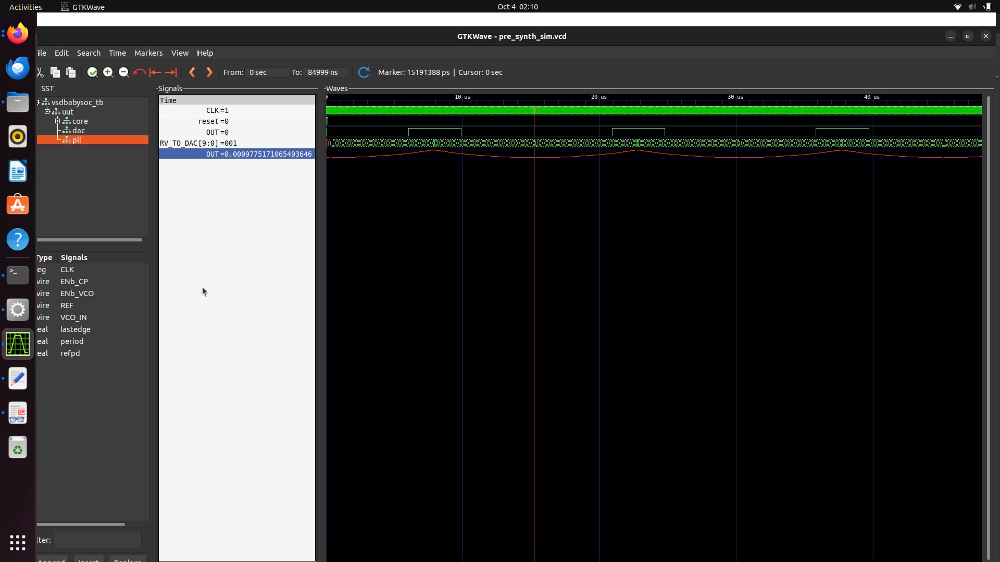

 VSDBabySoC – Week 2 Part 2 Labs(Functional Modelling)

This repo documents the **Week 2 task** of the [SFAL VSD SoC Journey](https://github.com/hemanthkumardm/SFAL-VSD-SoC-Journey).
The goal is to set up tools, generate Verilog from TL-Verilog, compile the BabySoC design, and verify functionality with **Icarus Verilog** and **GTKWave**.

---

 Setup Instructions

Follow these commands in order to install dependencies and configure your environment.

```
# 1. Update system
sudo apt update

# 2. Install Python pip
sudo apt install python3-pip

# 3. Install SandPiper-SaaS (TL-Verilog to Verilog converter)
pip3 install sandpiper-saas

# 4. Add local bin to PATH (needed for sandpiper-saas)
export PATH=$HOME/.local/bin:$PATH

# 5. Make this PATH change permanent
echo 'export PATH=$HOME/.local/bin:$PATH' >> ~/.bashrc

# 6. Verify installation
sandpiper-saas --version
```

---

 Building BabySoC

```
# 1. Go to VSDBabySoC folder
cd ~/VSDBabySoC

# 2. Run pre-synthesis simulation build
make pre_synth_sim
```

---

 Running Simulation

```
# Run compiled output
./output/pre_synth_sim/pre_synth_sim.out
```


 Viewing Waveforms

```
gtkwave output/pre_synth_sim/pre_synth_sim.vcd
```
 Reset Operation


This screenshot shows the BabySoC reset waveform. The CPU registers are initialized and clock starts running after reset.

Signal Explanations in BabySoC Waveform

When analyzing BabySoC waveforms in GTKWave, the following key signals can be observed:

* **`CLK`**

  * This is the input clock signal of the **RVMYTH core**.
  * Originally, it is generated by the **PLL** and ensures all modules run synchronously.

* **`reset`**

  * This is the input reset signal of the **RVMYTH core**.
  * It comes from an **external source** and is used to initialize the system into a stable state.

* **`RV_TO_DAC[9:0]`**

  * This is the **10-bit output bus** (`[9:0]`) from the RVMYTH core.
  * It originates from the **RVMYTH register #17**, which holds the digital values meant for conversion.
  * These values are fed to the **DAC** for analog signal generation.

* **`OUT` (Digital)**

  * This is the **digital output signal** of the BabySoC module.
  * It comes from the **DAC**, but due to simulation restrictions, it behaves as a **digital signal** (which is not fully accurate to real hardware).

* **`OUT` (Analog / Real type)**

  * This is a **real datatype wire** that can represent **analog values** during simulation.
  * It is the output of the DAC module.
  * To visualize it properly in GTKWave, **change the Data Format → Analog → Step**.

---
