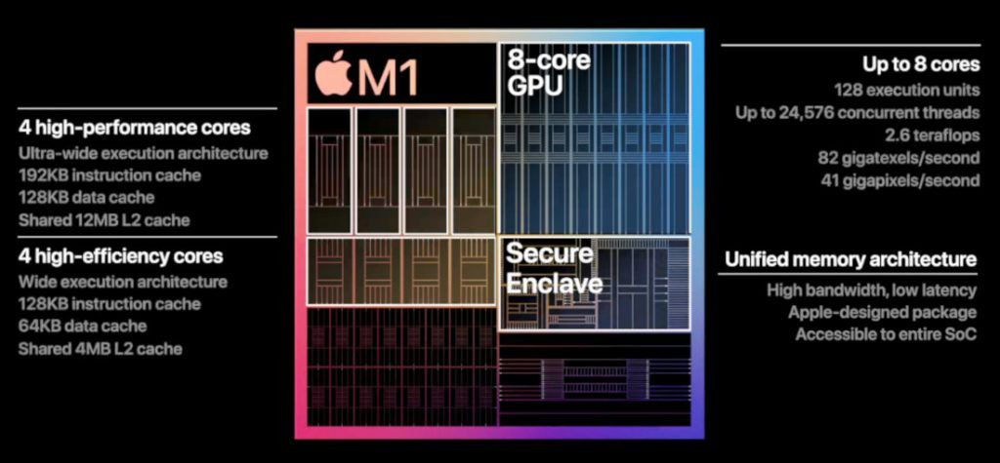
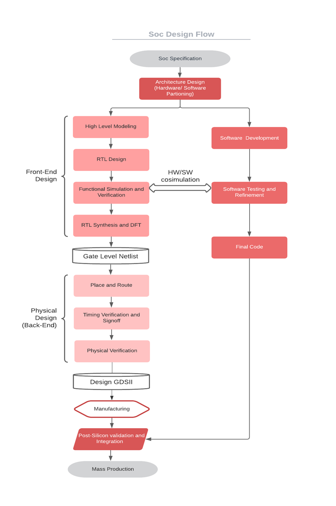

 Week 2 Part 1 – BabySoC Fundamentals & Functional Modelling

Objective
The aim of this week’s task is to build a strong foundation in **System-on-Chip (SoC) design** and understand how **functional modelling** plays a role in the early stages of chip development.  
By studying the simplified **BabySoC**, we focus on the core ideas behind SoC architecture without being overwhelmed by real-world complexity. This task also helps us practice simulation using **Icarus Verilog** and waveform analysis with **GTKWave**.

 What is a System-on-Chip (SoC)?
A **System-on-Chip (SoC)** is an integrated circuit that consolidates the essential components of a computer system into a single chip. Instead of having multiple discrete chips (processor, memory, peripherals), everything is embedded on the same die.  

This integration brings several advantages:
- **Performance** – Faster communication since components are on-chip.
- **Power Efficiency** – Consumes less power compared to multi-chip designs.
- **Compactness** – Reduces board space and cost.
- **Reliability** – Fewer inter-chip connections mean fewer failure points.

Modern devices like smartphones, wearables, IoT nodes, and even high-performance processors rely heavily on SoC designs.

Components of a Typical SoC
1. **CPU (Central Processing Unit / Processor Core)**  
   - The computational engine of the SoC.  
   - Executes instructions, performs arithmetic/logical operations, and controls overall system behavior.  
   - In BabySoC, a simple **RISC-V based processor** is used for learning purposes.

2. **Memory**  
   - Stores both data and instructions.  
   - Typically includes:
     - **Volatile memory (RAM)** for temporary storage.
     - **Non-volatile memory (ROM/Flash)** for program storage.  
   - Acts as the workspace where the CPU fetches instructions and stores results.

3. **Peripherals**  
   - Allow the SoC to interact with the outside world.  
   - Examples include UART for serial communication, GPIO for input/output control, and timers for scheduling tasks.  
   - They extend the capabilities of the CPU beyond basic computation.

4. **Interconnect / Bus**  
   - The backbone that connects CPU, memory, and peripherals.  
   - Ensures smooth communication between components.  
   - Examples in real-world SoCs include **AMBA buses** like AXI, AHB, and APB.

---
 Why BabySoC?
Designing and verifying a full-fledged industrial SoC is extremely complex. BabySoC is introduced as a **minimalistic model** to make SoC concepts more approachable.  

- **Simplified Architecture**: Focuses only on the CPU, memory, and a few peripherals.  
- **Hands-on Learning**: Lets students simulate and analyze SoC behavior early.  
- **Bridging Theory and Practice**: Instead of just reading about SoCs, BabySoC helps us *experiment*.  
- **Stepping Stone**: Once comfortable with BabySoC, learners can move toward RTL coding, synthesis, and physical design stages.

---
Role of Functional Modelling
Before diving into **RTL (Register Transfer Level)** design or **physical implementation**, it is essential to verify the **functionality** of the SoC. This is where functional modelling comes in.  

### Why is it important?
- Detects **logical errors** early, before they propagate into later stages.  
- Saves time and reduces cost by minimizing design re-spins.  
- Helps visualize how CPU, memory, and peripherals interact.  
- Builds confidence in design decisions before committing to hardware.

### How do we do it?
- **Icarus Verilog (iverilog)** is used for compiling Verilog testbenches and designs.  
- **GTKWave** is used to analyze the generated waveform (`.vcd`) files.  
- By simulating BabySoC, we can trace signals, check data flow, and ensure expected behavior.

---
 Key Learnings from Week 2
- A System-on-Chip integrates **CPU, memory, peripherals, and interconnect** on a single chip to provide a complete computing system.  
- BabySoC acts as a **learning platform** that simplifies SoC design for beginners.  
- **Functional modelling** is the first checkpoint in SoC design flow, ensuring that the basic system works correctly before RTL and physical design.  
- Tools like **Icarus Verilog** and **GTKWave** provide valuable insight into simulation and debugging.

---

 Conclusion
The BabySoC is not just a toy model—it represents the essence of how modern chips are structured. By starting with this simplified version, we gain the intuition needed to tackle more complex designs later.  
Functional modelling reminds us that in chip design, **verification always comes before implementation**. This philosophy ensures robust designs and forms the backbone of the semiconductor industry workflow.
